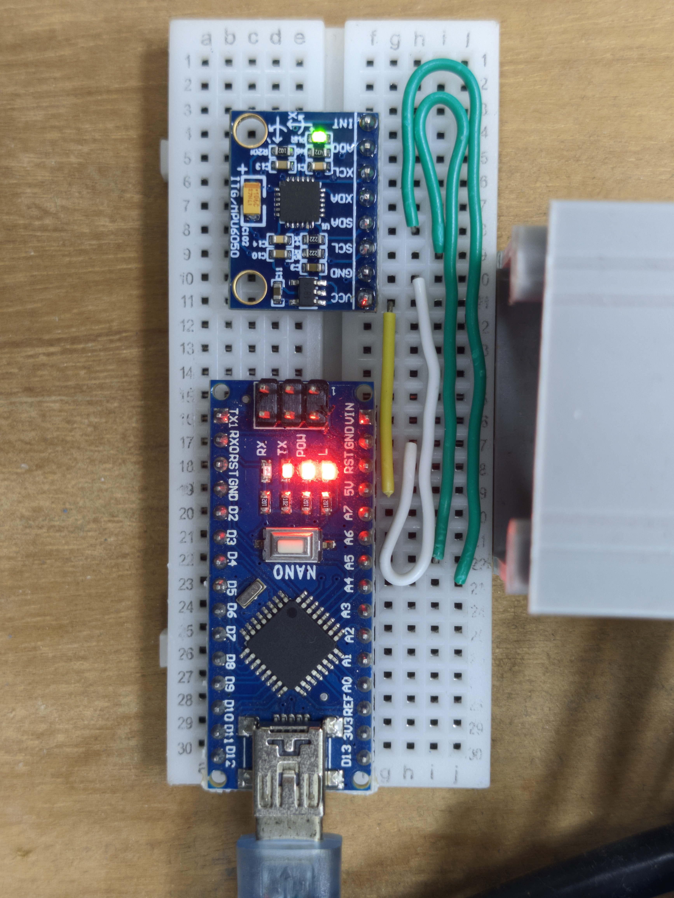

# Arduino MPU-6050 to Serial Firmware
An Arduino firmware that turns the mpu6050 imu to serial-based, capable with STM32 miniAHRS board. (For my research need)  
ROS2 Driver and refrence board can be find out here:  
https://github.com/Bob-YsPan/serial_ahrs_driver  
## Example connection for this firmware
  
